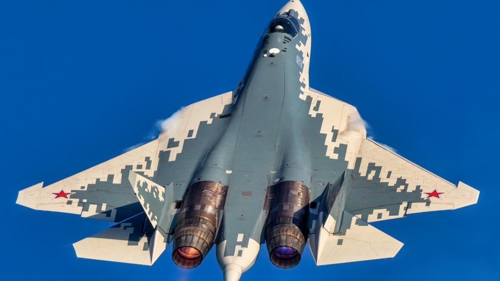
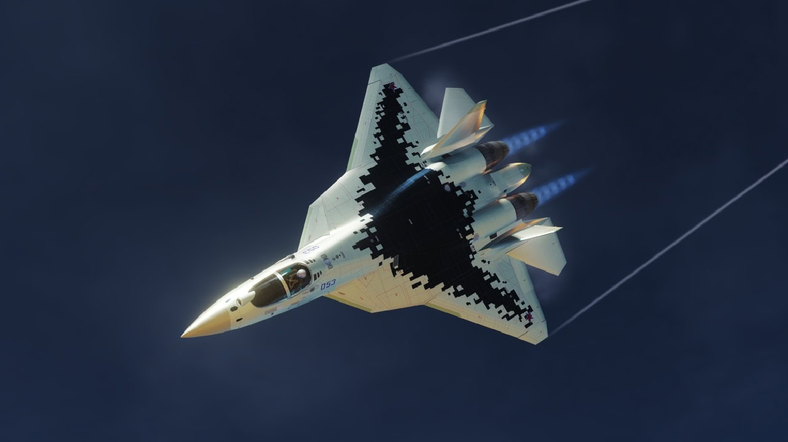
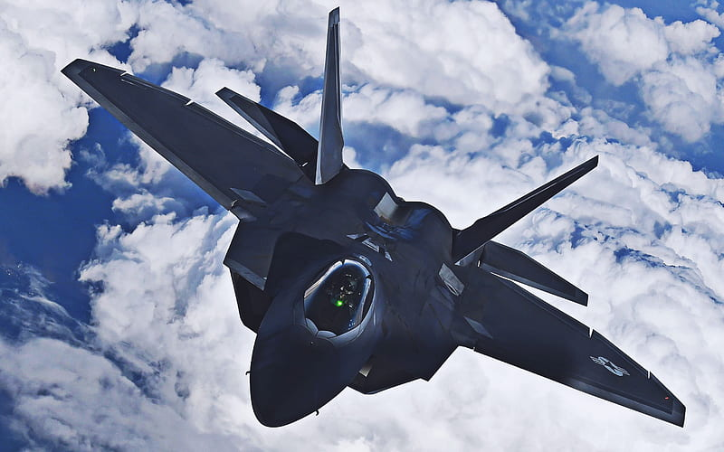
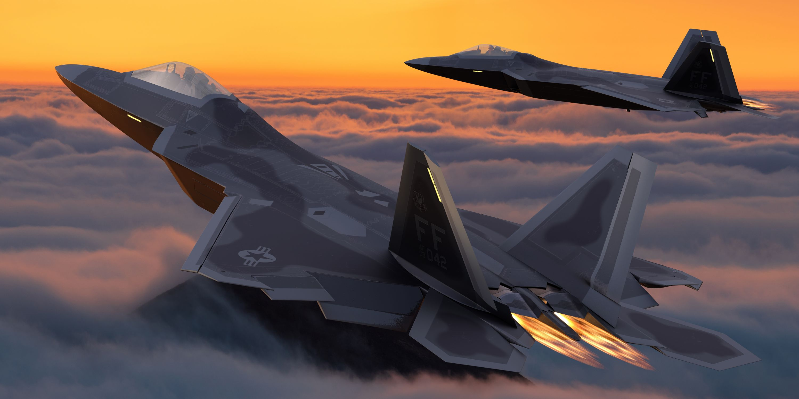
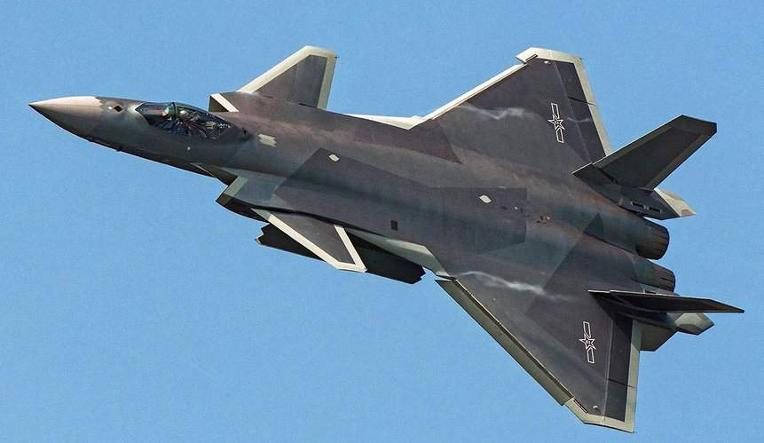
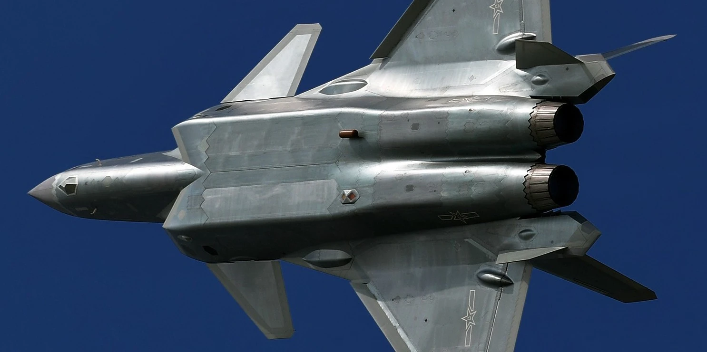
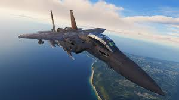
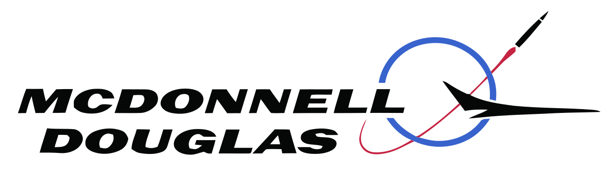

<!DOCTYPE html>
<html lang="es">
<head>
  <meta charset="UTF-8">
  <meta name="viewport" content="width=device-width, initial-scale=1.0">
  <title>AIR FORCE</title>
  
  
</head>
<body>
  <header>
    <h1>FIGHTERS AIR FORCE</h1>
    <input class="buscador" id="buscador" type="text" placeholder="Buscar avión..." oninput="filtrarAviones()">
  </header>

  

    <video controls>
      <source src="ssstik.io_1757720937426.mp4" type="video/mp4">
    </video>
  

  <main>
    

  

    <h2>Su-57 Felon</h2>
    
<strong>Tipo:</strong> Caza furtivo de quinta generación

    
<strong>Fabricante:</strong> Sukhoi (Rusia)

    
<strong>Velocidad Máxima:</strong> Mach 2.0

    
<strong>Armamento:</strong> Misiles aire-aire, aire-tierra, cañón interno

    
<strong>Descripción:</strong> El Su-57 es el primer caza furtivo ruso, diseñado para competir con los cazas occidentales. Incorpora tecnología stealth, supercrucero y alta maniobrabilidad.

    <button class="mostrar-btn" onclick="toggleDetalles('detalles-su57')">Mostrar detalles</button>
    

      <ul>
        <li>Primer vuelo: 2010</li>
        <li>Tripulación: 1</li>
        <li>Radio de combate: 1,500 km</li>
        <li>Motor: Saturn Izdeliye 30</li>
        <li><a href="https://es.wikipedia.org/wiki/Sukhoi_Su-57" target="_blank">Wikipedia</a></li>
      </ul>
    

  

  

    <button class="flecha izq" onclick="cambiarImagen('galeria-su57', -1)">&lt;</button>
    
    
    
    <button class="flecha der" onclick="cambiarImagen('galeria-su57', 1)">&gt;</button>
  

   

  

    <h2>F-22 Raptor</h2>
    
<strong>Tipo:</strong> Caza furtivo de superioridad aérea

    
<strong>Fabricante:</strong> Lockheed Martin (EE. UU.)

    
<strong>Velocidad Máxima:</strong> Mach 2.25

    
<strong>Armamento:</strong> Misiles aire-aire, bombas guiadas, cañón M61A2

    
<strong>Descripción:</strong> El F-22 es considerado uno de los cazas más avanzados del mundo, con capacidades stealth, supercrucero y sistemas electrónicos de última generación.

    <button class="mostrar-btn" onclick="toggleDetalles('detalles-f22')">Mostrar detalles</button>
    

      <ul>
        <li>Primer vuelo: 1997</li>
        <li>Tripulación: 1</li>
        <li>Radio de combate: 760 km</li>
        <li>Motor: Pratt & Whitney F119</li>
        <li><a href="https://es.wikipedia.org/wiki/Lockheed_Martin_F-22_Raptor" target="_blank">Wikipedia</a></li>
      </ul>
    

  

  

    <button class="flecha izq" onclick="cambiarImagen('galeria-f22', -1)">&lt;</button>
    
    
    
    <button class="flecha der" onclick="cambiarImagen('galeria-f22', 1)">&gt;</button>
  

    

  

    <h2>Chengdu J-20</h2>
    
<strong>Tipo:</strong> Caza furtivo de largo alcance

    
<strong>Fabricante:</strong> Chengdu Aerospace Corporation (China)

    
<strong>Velocidad Máxima:</strong> Mach 2.0

    
<strong>Armamento:</strong> Misiles aire-aire, bombas guiadas

    
<strong>Descripción:</strong> El J-20 es el primer caza furtivo chino, diseñado para misiones de penetración profunda y superioridad aérea, con tecnología stealth y avanzada aviónica.

    <button class="mostrar-btn" onclick="toggleDetalles('detalles-j20')">Mostrar detalles</button>
    

      <ul>
        <li>Primer vuelo: 2011</li>
        <li>Tripulación: 1</li>
        <li>Radio de combate: 1,100 km</li>
        <li>Motor: WS-10B</li>
        <li><a href="https://es.wikipedia.org/wiki/Chengdu_J-20" target="_blank">Wikipedia</a></li>
      </ul>
    

  

  

    <button class="flecha izq" onclick="cambiarImagen('galeria-j20', -1)">&lt;</button>
    
    
    
    <button class="flecha der" onclick="cambiarImagen('galeria-j20', 1)">&gt;</button>
  

    

  

    <h2>F-15 Eagle / F-15EX</h2>
    
<strong>Tipo:</strong> Caza de superioridad aérea / multirrol

    
<strong>Fabricante:</strong> McDonnell Douglas / Boeing (EE. UU.)

    
<strong>Velocidad Máxima:</strong> Mach 2.5

    
<strong>Armamento:</strong> Misiles aire-aire, bombas, cañón M61 Vulcan

    
<strong>Descripción:</strong> El F-15 es uno de los cazas más exitosos de la historia, con una tasa de victorias excepcional y versiones modernizadas como el F-15EX, que incorpora aviónica avanzada, radar AESA, arquitectura digital abierta y capacidad para transportar hasta 22 misiles aire-aire.

    <button class="mostrar-btn" onclick="toggleDetalles('detalles-f15')">Mostrar detalles</button>
    

      <ul>
        <li>Primer vuelo: 1972 (F-15 Eagle) / 2021 (F-15EX)</li>
        <li>Tripulación: 1 o 2</li>
        <li>Radio de combate: 1,967 km</li>
        <li>Motor: Pratt & Whitney F100 / F110 (según variante)</li>
        <li><a href="https://es.wikipedia.org/wiki/Boeing_F-15EX_Eagle_II" target="_blank">Wikipedia</a></li>
      </ul>
    

  

  

    <button class="flecha izq" onclick="cambiarImagen('galeria-f15', -1)">&lt;</button>
    
    
    
    <button class="flecha der" onclick="cambiarImagen('galeria-f15', 1)">&gt;</button>
  

  </main>

  <footer>
    © 2025 | Página creada por Vicente | Proyecto Universidad
  </footer>
</body>
</html>
